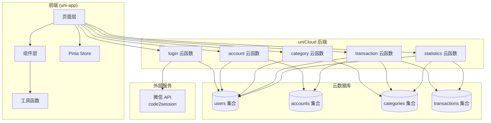
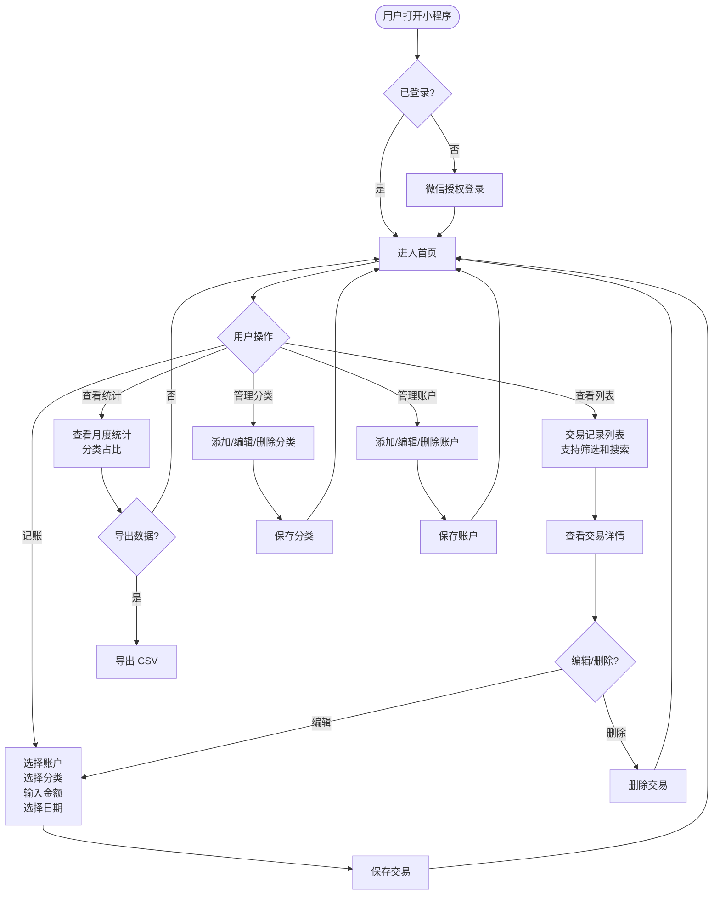
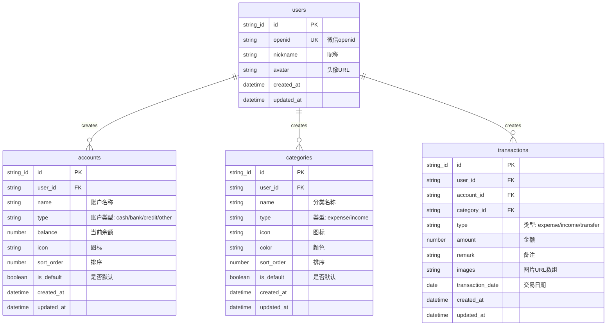
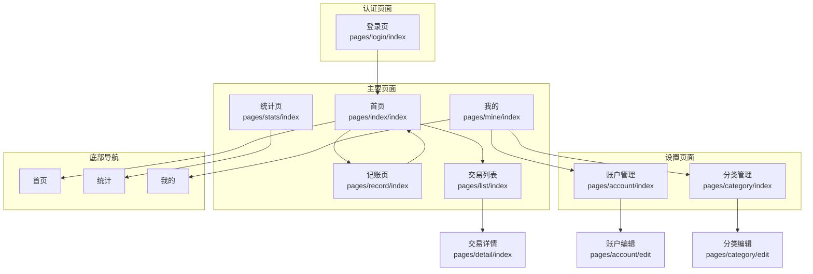

# 记账软件 - 架构设计文档

## 项目概述

一个简洁的记账应用，用户通过微信授权登录后，可以记录日常收支、管理分类、查看基础统计。

**核心功能**：
- 微信授权登录
- 记账功能（收入/支出）
- 分类管理
- 基础统计分析

---

## 技术栈

| 层级 | 技术选型 |
|-----|---------|
| 前端框架 | uni-app (Vue 3 + TypeScript) |
| UI 样式 | UnoCSS |
| 状态管理 | Pinia |
| 路由 | uni-app 内置路由 |
| 后端 | uniCloud 云函数 (阿里云) |
| 数据库 | uniCloud 云数据库 |
| 认证 | 微信小程序授权登录 + uni-id |
| 图表 | uCharts 或 ECharts |
| 目标平台 | 微信小程序 + H5 |

---

## 1. 系统架构图



---

## 2. 核心业务流程图



---

## 3. 数据模型图



### 数据字段说明

#### users 集合
| 字段 | 类型 | 必填 | 说明 |
|-----|------|-----|------|
| _id | string | 是 | 主键 |
| openid | string | 是 | 微信 openid，唯一索引 |
| nickname | string | 否 | 用户昵称 |
| avatar | string | 否 | 头像 URL |
| created_at | timestamp | 是 | 创建时间 |
| updated_at | timestamp | 是 | 更新时间 |

#### accounts 集合
| 字段 | 类型 | 必填 | 说明 |
|-----|------|-----|------|
| _id | string | 是 | 主键 |
| user_id | string | 是 | 用户 ID，索引 |
| name | string | 是 | 账户名称，如"现金"、"招商银行" |
| type | string | 是 | 账户类型：cash(现金)/bank(银行卡)/credit(信用卡)/other(其他) |
| balance | number | 是 | 当前余额 |
| icon | string | 否 | 图标（emoji 或图标名称） |
| sort_order | number | 是 | 排序，越小越靠前 |
| is_default | boolean | 是 | 是否默认账户 |
| create_by | string | 是 | 创建者 openid，空字符串表示系统默认账户 |
| created_at | timestamp | 是 | 创建时间 |
| updated_at | timestamp | 是 | 更新时间 |

#### categories 集合
| 字段 | 类型 | 必填 | 说明 |
|-----|------|-----|------|
| _id | string | 是 | 主键 |
| user_id | string | 是 | 用户 ID，索引 |
| name | string | 是 | 分类名称，如"餐饮"、"交通" |
| type | string | 是 | 类型：expense(支出)/income(收入) |
| icon | string | 否 | 图标（emoji 或图标名称） |
| color | string | 否 | 颜色值，如 #FF6B6B |
| sort_order | number | 是 | 排序，越小越靠前 |
| is_default | boolean | 是 | 是否系统默认分类 |
| create_by | string | 是 | 创建者 openid，空字符串表示系统默认分类 |
| created_at | timestamp | 是 | 创建时间 |
| updated_at | timestamp | 是 | 更新时间 |

#### transactions 集合
| 字段 | 类型 | 必填 | 说明 |
|-----|------|-----|------|
| _id | string | 是 | 主键 |
| user_id | string | 是 | 用户 ID，索引 |
| account_id | string | 是 | 账户 ID |
| category_id | string | 是 | 分类 ID |
| type | string | 是 | 类型：expense(支出)/income(收入)/transfer(转账) |
| amount | number | 是 | 金额（正数） |
| remark | string | 否 | 备注说明 |
| images | array | 否 | 图片 URL 数组 |
| transaction_date | date | 是 | 交易日期，索引 |
| created_at | timestamp | 是 | 创建时间 |
| updated_at | timestamp | 是 | 更新时间 |

---

## 4. 页面结构图



### 页面说明

| 页面 | 路径 | 功能说明 |
|-----|------|---------|
| 登录页 | /pages/login/index | 微信授权登录 |
| 首页 | /pages/index/index | 显示近期交易、快捷记账入口 |
| 记账页 | /pages/record/index | 选择账户、分类、输入金额、备注 |
| 交易列表 | /pages/list/index | 显示交易记录，支持筛选、搜索 |
| 交易详情 | /pages/detail/index | 查看单笔交易详情，支持编辑删除 |
| 统计页 | /pages/stats/index | 月度收支统计、分类占比图表 |
| 账户管理 | /pages/account/index | 查看和管理账户列表 |
| 账户编辑 | /pages/account/edit | 添加/编辑账户 |
| 分类管理 | /pages/category/index | 查看和管理分类列表 |
| 分类编辑 | /pages/category/edit | 添加/编辑分类 |
| 我的 | /pages/mine/index | 个人中心、设置入口 |

---

## 4.1 数据隔离和游客模式设计

### createBy 数据隔离模式

参考 Toolbox 项目的设计理念，使用 `create_by` 字段实现数据隔离：

| createBy 值 | 含义 | 访问权限 |
|------------|------|---------|
| 用户 openid | 用户私有数据 | 仅该用户可读写 |
| 空字符串 '' | 系统/公共数据 | 所有用户只读 |

**查询用户数据 + 公共数据：**
```javascript
// 云函数中的查询逻辑
const db = uniCloud.database()
const openid = event.openid

collection().where(
  db.command.or([
    { create_by: openid },   // 用户私有数据
    { create_by: '' }        // 公共数据
  ])
)
```

### 游客模式设计

**状态管理：**
```javascript
// store/user.js
state: {
  openid: '',
  userData: {},
  isGuest: true,      // 游客状态标识
  authStateVersion: 0 // 授权状态版本号
}
```

**游客 vs 已登录用户：**

| 功能 | 游客状态 | 已登录状态 |
|-----|---------|-----------|
| 查看系统默认分类 | ✅ 可查看 | ✅ 可查看 |
| 查看系统默认账户 | ✅ 可查看 | ✅ 可查看 |
| 查看用户分类 | ❌ 无数据 | ✅ 可查看 |
| 查看用户账户 | ❌ 无数据 | ✅ 可查看 |
| 查看交易记录 | ❌ 显示空状态 | ✅ 可查看 |
| 创建交易 | ❌ 触发登录 | ✅ 可创建 |
| 管理分类/账户 | ❌ 触发登录 | ✅ 可管理 |

**API 封装设计：**
```javascript
// utils/api-auth.js
export function withAuth(apiFunction, store, options = {}) {
  return async function(...args) {
    const isLoggedIn = await checkLoginBeforeRequest(store, options)
    if (!isLoggedIn) {
      return Promise.reject(new Error('用户未授权'))
    }
    return apiFunction.apply(this, args)
  }
}

// 使用示例
export const getCategoryList = function(data, options = {}) {
  const user = store.state.user

  // 游客只返回公共数据
  if (user.isGuest) {
    return getDb().collection('categories')
      .where({ create_by: '' })
      .get()
  }

  // 已登录返回用户数据 + 公共数据
  return withAuth(function(data) {
    return getDb().collection('categories')
      .where(db.command.or([
        { create_by: user.openid },
        { create_by: '' }
      ]))
      .get()
  }, store, options)(data)
}
```

---

## 5. 云函数 API 设计

### 5.1 login 云函数

微信授权登录

| 参数 | 类型 | 必填 | 说明 |
|-----|------|-----|------|
| code | string | 是 | wx.login() 获取的 code |
| userInfo | object | 否 | 用户信息（昵称、头像） |

**返回：**
```json
{
  "code": 0,
  "message": "success",
  "data": {
    "token": "eyJhbG...",
    "uid": "user_id",
    "newUser": true
  }
}
```

### 5.2 account 云函数

账户管理

**获取账户列表：**
```javascript
uniCloud.callFunction({
  name: 'account',
  data: { action: 'list' }
})
```

**创建账户：**
```javascript
uniCloud.callFunction({
  name: 'account',
  data: {
    action: 'create',
    name: '招商银行',
    type: 'bank',
    balance: 10000,
    icon: 'bank'
  }
})
```

**更新账户：**
```javascript
uniCloud.callFunction({
  name: 'account',
  data: {
    action: 'update',
    id: 'account_id',
    name: '招商银行',
    balance: 15000
  }
})
```

**删除账户：**
```javascript
uniCloud.callFunction({
  name: 'account',
  data: {
    action: 'delete',
    id: 'account_id'
  }
})
```

### 5.3 category 云函数

分类管理

**获取分类列表：**
```javascript
uniCloud.callFunction({
  name: 'category',
  data: {
    action: 'list',
    type: 'expense' // 'expense' | 'income'
  }
})
```

**创建分类：**
```javascript
uniCloud.callFunction({
  name: 'category',
  data: {
    action: 'create',
    name: '餐饮',
    type: 'expense',
    icon: 'food',
    color: '#FF6B6B'
  }
})
```

**更新分类：**
```javascript
uniCloud.callFunction({
  name: 'category',
  data: {
    action: 'update',
    id: 'category_id',
    name: '美食'
  }
})
```

**删除分类：**
```javascript
uniCloud.callFunction({
  name: 'category',
  data: {
    action: 'delete',
    id: 'category_id'
  }
})
```

### 5.4 transaction 云函数

交易记录管理

**获取交易列表：**
```javascript
uniCloud.callFunction({
  name: 'transaction',
  data: {
    action: 'list',
    page: 1,
    pageSize: 20,
    startDate: '2024-01-01',
    endDate: '2024-01-31',
    categoryId: 'category_id', // 可选
    accountId: 'account_id',   // 可选
    keyword: '午餐'             // 可选
  }
})
```

**创建交易：**
```javascript
uniCloud.callFunction({
  name: 'transaction',
  data: {
    action: 'create',
    accountId: 'account_id',
    categoryId: 'category_id',
    type: 'expense', // 'expense' | 'income' | 'transfer'
    amount: 50,
    remark: '午餐',
    images: ['https://...'],
    transactionDate: '2024-01-15'
  }
})
```

**更新交易：**
```javascript
uniCloud.callFunction({
  name: 'transaction',
  data: {
    action: 'update',
    id: 'transaction_id',
    amount: 60,
    remark: '午餐+饮料'
  }
})
```

**删除交易：**
```javascript
uniCloud.callFunction({
  name: 'transaction',
  data: {
    action: 'delete',
    id: 'transaction_id'
  }
})
```

### 5.5 statistics 云函数

统计分析

**获取月度统计：**
```javascript
uniCloud.callFunction({
  name: 'statistics',
  data: {
    action: 'monthly',
    year: 2024,
    month: 1
  }
})
```

**返回：**
```json
{
  "code": 0,
  "data": {
    "totalIncome": 10000,
    "totalExpense": 5000,
    "balance": 5000,
    "dailyStats": [
      { "date": "2024-01-01", "income": 0, "expense": 100 },
      { "date": "2024-01-02", "income": 5000, "expense": 200 }
    ],
    "categoryStats": [
      { "categoryId": "xxx", "categoryName": "餐饮", "amount": 1500, "percent": 30 }
    ]
  }
}
```

---

## 6. 默认数据

### 默认分类（支出）

| 名称 | 图标 | 颜色 |
|-----|------|------|
| 餐饮 | 🍜 | #FF6B6B |
| 交通 | 🚗 | #4ECDC4 |
| 购物 | 🛒 | #95E1D3 |
| 娱乐 | 🎮 | #F38181 |
| 医疗 | 💊 | #AA96DA |
| 教育 | 📚 | #FCBAD3 |
| 居住 | 🏠 | #FFFFD2 |
| 其他 📦 | #A8D8EA |

### 默认分类（收入）

| 名称 | 图标 | 颜色 |
|-----|------|------|
| 工资 | 💰 | #95E1D3 |
| 奖金 | 🎁 | #F38181 |
| 投资 | 📈 | #AA96DA |
| 其他 | 💵 | #A8D8EA |

### 默认账户

| 名称 | 类型 | 余额 | 图标 |
|-----|------|------|------|
| 现金 | cash | 0 | 💵 |
| 支付宝 | other | 0 | 💰 |
| 微信 | other | 0 | 💬 |

---

## 7. 环境变量配置

### uniCloud 云函数环境变量

在云函数中通过 `uniCloud.getCloudEnv()` 获取：

```javascript
// 微信小程序配置
const mpAppId = 'your_mini_program_appid'
const mpSecret = 'your_mini_program_secret'
```

### 前端配置

在 `manifest.json` 中配置：
- 微信小程序 AppID
- uniCloud 空间信息

---

## 8. 项目结构

```
account-app/
├── pages/                    # 页面
│   ├── index/                # 首页
│   │   └── index.vue
│   ├── login/                # 登录页
│   │   └── index.vue
│   ├── record/               # 记账页
│   │   └── index.vue
│   ├── list/                 # 交易列表
│   │   └── index.vue
│   ├── detail/               # 交易详情
│   │   └── index.vue
│   ├── stats/                # 统计页
│   │   └── index.vue
│   ├── mine/                 # 我的
│   │   └── index.vue
│   ├── account/              # 账户管理
│   │   ├── index.vue
│   │   └── edit.vue
│   └── category/             # 分类管理
│       ├── index.vue
│       └── edit.vue
├── components/               # 组件
│   ├── tx-card/              # 交易卡片
│   ├── category-picker/      # 分类选择器
│   ├── account-picker/       # 账户选择器
│   ├── amount-input/         # 金额输入
│   └── date-picker/          # 日期选择
├── store/                    # Pinia Store
│   ├── user.js               # 用户状态
│   ├── account.js            # 账户状态
│   ├── category.js           # 分类状态
│   └── transaction.js        # 交易状态
├── utils/                    # 工具函数
│   ├── request.js            # uniCloud 封装
│   ├── auth.js               # 认证相关
│   ├── date.js               # 日期处理
│   └── format.js             # 格式化
├── uni_modules/              # uniCloud 前端 SDK
├── static/                   # 静态资源
│   └── images/
├── manifest.json             # uni-app 配置
├── pages.json                # 页面路由配置
├── uni.scss                  # 全局样式变量
└── App.vue                   # 应用入口

uniCloud-aliyun/
├── cloudfunctions/           # 云函数
│   ├── common/               # 公共模块
│   ├── login/                # 登录云函数
│   │   └── index.js
│   ├── account/              # 账户管理
│   │   └── index.js
│   ├── category/             # 分类管理
│   │   └── index.js
│   ├── transaction/          # 交易管理
│   │   └── index.js
│   └── statistics/           # 统计分析
│       └── index.js
└── database/                 # 数据库 Schema
    ├── users.schema.json
    ├── accounts.schema.json
    ├── categories.schema.json
    └── transactions.schema.json
```

---

## 9. Vue3 + UnoCSS 配置

### 9.1 UnoCSS 配置

**安装依赖：**
```bash
npm install -D unocss
npm install -D @unocss/preset-uno @unocss/preset-icons
```

**uno.config.ts 配置：**
```typescript
import { defineConfig } from 'unocss'
import presetUno from '@unocss/preset-uno'
import presetIcons from '@unocss/preset-icons'

export default defineConfig({
  presets: [
    presetUno(),      // 默认预设
    presetIcons()     // 图标支持
  ],
  shortcuts: {
    // 自定义快捷类
    'flex-center': 'flex items-center justify-center',
    'flex-between': 'flex items-center justify-between',
    'text-primary': 'text-blue-500',
    'bg-primary': 'bg-blue-500',
  },
  theme: {
    colors: {
      // 主题色
      primary: {
        DEFAULT: '#3B82F6',
        light: '#60A5FA',
        dark: '#2563EB'
      }
    }
  }
})
```

**main.ts 中引入：**
```typescript
import { createSSRApp } from 'vue'
import App from './App.vue'
import { createPinia } from 'pinia'

// UnoCSS
import 'uno.css'
import 'virtual:uno.css'

export function createApp() {
  const app = createSSRApp(App)
  const pinia = createPinia()

  app.use(pinia)

  return {
    app
  }
}
```

### 9.2 Pinia 状态管理配置

**store/user.ts 模板：**
```typescript
import { defineStore } from 'pinia'

export const useUserStore = defineStore('user', {
  state: () => ({
    openid: '',
    userData: {} as any,
    isGuest: true,
    authStateVersion: 0
  }),

  getters: {
    isLoggedIn: (state) => !state.isGuest && !!state.openid
  },

  actions: {
    setOpenid(openid: string) {
      this.openid = openid
    },
    setUserData(userData: any) {
      this.userData = userData
    },
    setIsGuest(isGuest: boolean) {
      const wasGuest = this.isGuest
      this.isGuest = isGuest
      if (wasGuest === true && isGuest === false) {
        this.authStateVersion += 1
      }
    },
    async RestoreFromCache() {
      // 从本地缓存恢复登录状态
      const cachedOpenid = uni.getStorageSync('openid')
      if (cachedOpenid) {
        this.setOpenid(cachedOpenid)
        this.setIsGuest(false)
        return true
      }
      return false
    }
  }
})
```

### 9.3 Vue3 Composition API 组件模板

```vue
<template>
  <view class="flex-center h-screen">
    <view class="text-primary text-lg">{{ message }}</view>
  </view>
</template>

<script setup lang="ts">
import { ref, computed, onMounted } from 'vue'
import { useUserStore } from '@/store/user'

const userStore = useUserStore()

const message = ref('Hello World')
const isLoggedIn = computed(() => userStore.isLoggedIn)

onMounted(() => {
  console.log('Component mounted')
})
</script>

<style scoped>
/* UnoCSS 原子类已足够，无需额外样式 */
</style>
```

---

## 10. 开发规范

### 10.1 代码风格

- 使用 TypeScript
- 使用 Vue 3 Composition API + `<script setup>`
- 使用 UnoCSS 原子化样式
- 组件命名使用 PascalCase
- 文件命名使用 kebab-case

### 10.2 API 调用规范

**延迟初始化模式：**
```javascript
// utils/request.js
const callCloudFunction = (name, data) => {
  if (typeof uniCloud === 'undefined' || !uniCloud.callFunction) {
    return Promise.reject(new Error('uniCloud 未初始化'))
  }
  return uniCloud.callFunction({ name, data })
}
```

**权限封装模式：**
```javascript
// 所有写操作 API 都使用 withAuth 包装
export const addTransaction = withAuth(function(data) {
  return callCloudFunction('transaction', { action: 'create', ...data })
}, store)

// 读操作根据游客状态返回不同数据
export const getCategoryList = function(data, options = {}) {
  if (store.state.user.isGuest) {
    return getPublicCategories(data)
  }
  return withAuth(getUserCategories, store, options)(data)
}
```

### 10.3 状态管理规范

| Store | 用途 |
|-------|------|
| useUserStore() | 用户状态、登录状态、游客模式 |
| useAccountStore() | 账户列表、默认账户 |
| useCategoryStore() | 分类列表（支出/收入） |
| useTransactionStore() | 交易列表、筛选条件 |

### 10.4 数据库操作规范

**查询规范：**
```javascript
// ✅ 正确：使用 where + command.or
collection().where(
  db.command.or([
    { create_by: userOpenid },
    { create_by: '' }
  ])
)

// ❌ 错误：直接查询所有数据
collection().get()
```

**写入规范：**
```javascript
// ✅ 正确：写入时设置 create_by
const data = {
  name: '新分类',
  create_by: userOpenid  // 必须设置
}
collection().add(data)

// ❌ 错误：不设置 create_by
collection().add({ name: '新分类' })
```

### 10.5 云函数开发规范

**统一返回格式：**
```javascript
exports.main = async (event, context) => {
  try {
    // 业务逻辑...
    return {
      code: 0,
      message: 'success',
      data: result
    }
  } catch (error) {
    return {
      code: -1,
      message: error.message,
      data: null
    }
  }
}
```

**权限验证：**
```javascript
// 验证用户是否为数据所有者
const verifyOwnership = (openid, dataUserId) => {
  if (openid !== dataUserId) {
    throw new Error('无权操作此数据')
  }
}
```

### 代码风格

- 使用 TypeScript
- 使用 Vue 3 Composition API + `<script setup>`
- 使用 UnoCSS 原子化样式
- 组件命名使用 PascalCase
- 文件命名使用 kebab-case

### API 调用规范

- 统一使用封装的 `request.js` 调用云函数
- 错误统一处理
- Loading 状态统一管理

### 状态管理规范

- 用户状态：`useUserStore()`
- 账户状态：`useAccountStore()`
- 分类状态：`useCategoryStore()`
- 交易状态：`useTransactionStore()`

---

## 10. 开发流程

1. **初始化项目**：运行 `./init.sh`
2. **创建数据库 Schema**：在 uniCloud 控制台创建集合
3. **开发云函数**：按顺序开发各个云函数
4. **开发前端页面**：按功能模块开发页面
5. **联调测试**：在真机和小程序开发工具中测试
6. **发布上线**：上传云函数 → 提交小程序审核
